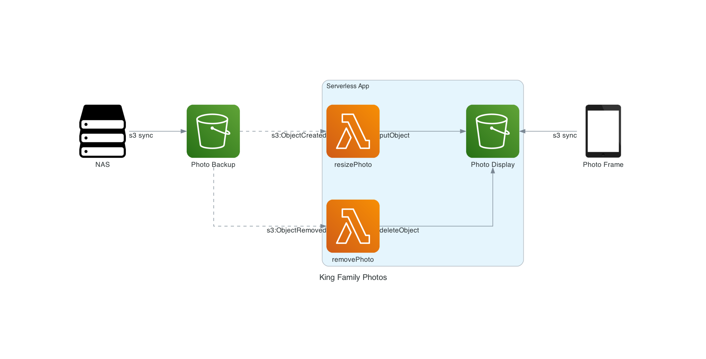

# King Family Photos

A Serverless app for distributing digital photo frame content. Built in Golang, CI/CD in GitHub Actions, hosted in AWS and deployed with [serverless](https://www.serverless.com/).



1. Photos on home media server are synced to `backup bucket`
1. New photos in bucket trigger `resizePhoto` lambda to copy smaller resolution version of image to `display bucket`
1. Digital photo frame downloads new images every night at `00:00` and restarts
1. Photos removed from `backup bucket` trigger `removePhoto` lambda to remove photo from `display bucket`

## Requirements

- golang
- serverless framework
- AWS account and SDK

## Deployment

The application requires an S3 bucket to consume events from. This bucket exists outside the application in order to avoid accidental deletion. Photos uploaded to this bucket will be ingested by the `resizePhoto` lambda. The bucket should be named `APP_NAME-live-ingest`. App name can be edited in `serverless.yaml`

Application can be deployed in `dev` and `live` environments with the `makefile`

```bash
make deploy-dev

make deploy-live
```

Environments can be torn down with:

```bash
make teardown-dev

make teardown-live
```

## CI/CD

Unit tests, integration tests and deployment can be handled by `GitHub Actions`. To do this, you will need to generate `AWS_ACESS_KEY` and `AWS_SECRET_ACCESS_KEY` for the GitHub service. They should be stored in github as secrets named `AWS_KEY` and `AWS_SECRET` respectively.
